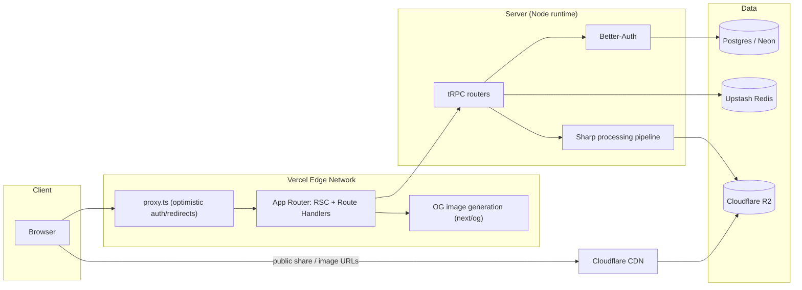
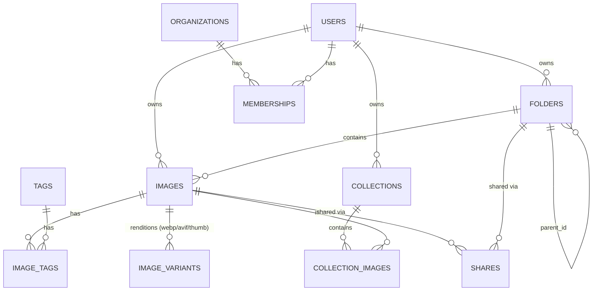

# Image Manager — Architecture

Living document. Update it when a decision here turns out to be wrong — don't let it drift from reality. See [ROADMAP.md](ROADMAP.md) for what's actually built vs. planned, and [CLAUDE.md](../CLAUDE.md) for the AI-agent quick-start.

## 1. Technology stack & reasoning

The product has two faces that pull in different directions: public, crawlable, SEO-critical pages (share links, collections, marketing) and a rich, interactive authenticated dashboard (bulk upload, drag-and-drop, search). The stack is chosen to serve both without compromising either.

| Layer              | Choice                                                                                                                                                                        | Why                                                                                                                                                                                                                                                                                                                                                                                                                                                                                              |
| ------------------ | ----------------------------------------------------------------------------------------------------------------------------------------------------------------------------- | ------------------------------------------------------------------------------------------------------------------------------------------------------------------------------------------------------------------------------------------------------------------------------------------------------------------------------------------------------------------------------------------------------------------------------------------------------------------------------------------------ |
| Frontend framework | **Next.js 16** (App Router, RSC, Cache Components)                                                                                                                            | Only framework with a mature, integrated story for SSR + SSG + ISR + streaming + Partial Prerendering _in the same route_, plus first-class Metadata API, `next/image`, `next/font`. Considered Astro (weaker for a stateful authenticated app), Remix/React Router v7 (smaller ecosystem, no RSC), SvelteKit/Nuxt (smaller Node/edge/SEO tooling ecosystem). Per-route rendering choice lets public share/collection pages be static/ISR (crawlable, instant TTFB) while the dashboard streams. |
| Language           | **TypeScript**, strict mode                                                                                                                                                   | Non-negotiable for a codebase meant to be handed between AI sessions and humans — types are the shared source of truth.                                                                                                                                                                                                                                                                                                                                                                          |
| API architecture   | **tRPC** (internal) + **Route Handlers** (public/webhooks)                                                                                                                    | tRPC gives end-to-end type inference from server to client with zero codegen for all internal dashboard traffic. Plain Route Handlers are used where the contract must be plain HTTP/cacheable/public: share-link resolution, `sitemap.xml`, `robots.txt`, OG image generation, webhooks.                                                                                                                                                                                                        |
| ORM                | **Drizzle ORM**                                                                                                                                                               | SQL-like query builder, no engine binary (unlike Prisma), fast cold starts, edge-runtime compatible, first-class TS inference.                                                                                                                                                                                                                                                                                                                                                                   |
| Database           | **PostgreSQL via Neon**                                                                                                                                                       | Serverless Postgres with instant branching — every PR preview gets an isolated DB branch. Scales from free tier to enterprise without a migration to a different engine.                                                                                                                                                                                                                                                                                                                         |
| Authentication     | **Better-Auth**                                                                                                                                                               | Open-source, self-hosted, no per-MAU billing or vendor lock-in, framework-agnostic, edge-compatible, and its organization/RBAC plugin covers role-based folder/collection permissions natively.                                                                                                                                                                                                                                                                                                  |
| Styling            | **Tailwind CSS v4** + custom design tokens, `next-themes`, `class-variance-authority`                                                                                         | Apple HIG-inspired token set (oklch colors, HIG type scale, radius/shadow scales) defined once in `src/app/globals.css` and consumed as Tailwind utilities everywhere — no hardcoded colors/spacing in components. `next-themes` handles light/dark without a FOUC; `cva` keeps component variants (button/badge/panel) declarative. See [CLAUDE.md § Design system](../CLAUDE.md#design-system) for the full token reference.                                                                   |
| Image processing   | **Sharp** (libvips) + `next/image`                                                                                                                                            | Server-side resize and AVIF/WebP re-encoding at upload time; `next/image` handles responsive `srcset`, lazy loading, and format negotiation at render time. `plaiceholder`/blurhash generate LQIP placeholders to protect CLS.                                                                                                                                                                                                                                                                   |
| Storage            | **Cloudflare R2**                                                                                                                                                             | S3-compatible API (works with the standard AWS SDK) but zero egress fees — critical since this product's bandwidth profile is dominated by serving images, including to anonymous visitors of public share links.                                                                                                                                                                                                                                                                                |
| Caching            | **Upstash Redis** + Next.js Cache Components                                                                                                                                  | Upstash for rate limiting, session lookups, and background job queues (HTTP-based, works from edge runtimes); Cache Components (`"use cache"`) for data/UI caching inside Next.js itself.                                                                                                                                                                                                                                                                                                        |
| CDN / hosting      | **Vercel** (app) + **Cloudflare** (in front of R2)                                                                                                                            | Vercel has the deepest Next.js integration (ISR, Image Optimization, Edge Network, preview deploys, Speed Insights). Cloudflare CDN fronts R2 for the heaviest bandwidth path at zero egress cost.                                                                                                                                                                                                                                                                                               |
| Build system       | **Turbopack** (Next.js default)                                                                                                                                               | Faster cold starts and HMR than Webpack; now the Next.js default.                                                                                                                                                                                                                                                                                                                                                                                                                                |
| Package manager    | **pnpm**                                                                                                                                                                      | Strict `node_modules` (no phantom dependencies), fastest installs, disk-efficient, straightforward path to a monorepo later if needed.                                                                                                                                                                                                                                                                                                                                                           |
| Testing            | **Vitest** + Testing Library (unit/component), **Playwright** (e2e)                                                                                                           | Vitest shares Vite's transform pipeline (fast, ESM-native). Playwright covers real-browser critical paths and is also used for accessibility assertions via `@axe-core/playwright` once UI exists.                                                                                                                                                                                                                                                                                               |
| Lint/format        | **ESLint** (`eslint-config-next`, bundles `jsx-a11y`) + **Prettier** (`prettier-plugin-tailwindcss`)                                                                          | `eslint-config-next` is the only linter with Next-specific correctness rules (image/font/script usage); `jsx-a11y` is bundled, which matters given the accessibility=100 target. Biome was considered for speed but doesn't yet match this a11y/Next rule coverage.                                                                                                                                                                                                                              |
| Type safety        | TS strict + **Zod**                                                                                                                                                           | Zod schemas are the single source of truth for validation, shared verbatim between client forms, server actions, and tRPC input/output.                                                                                                                                                                                                                                                                                                                                                          |
| State management   | RSC for server state by default; **TanStack Query** (via tRPC) for client-fetched server state; **Zustand** for local UI state; **React Hook Form** + Zod resolvers for forms | See §7.                                                                                                                                                                                                                                                                                                                                                                                                                                                                                          |
| Logging            | **Pino**                                                                                                                                                                      | Structured JSON logs, fast, works in both Node and Edge runtimes.                                                                                                                                                                                                                                                                                                                                                                                                                                |
| Monitoring         | **Sentry** + **Vercel Speed Insights**                                                                                                                                        | Sentry for errors and tracing; Speed Insights for real-user Core Web Vitals (lab tools like Lighthouse don't reflect real traffic).                                                                                                                                                                                                                                                                                                                                                              |
| Analytics          | **PostHog**                                                                                                                                                                   | Self-hostable, product analytics + feature flags — used to roll out features incrementally without a big-bang release.                                                                                                                                                                                                                                                                                                                                                                           |

## 2. High-level system architecture



**Request flow, public/SEO surface:** crawler or visitor hits a share/collection URL → served from Vercel's static/ISR cache (Cache Components) with full HTML on first byte → images referenced via `next/image` pointed at the Cloudflare-fronted R2 domain.

**Request flow, authenticated dashboard:** browser hits an app route → `proxy.ts` does an optimistic session check (redirect if clearly logged out) → RSC renders the shell + `<Suspense>` boundaries → tRPC procedures (real auth check happens here, server-side, always) read/write Postgres and enqueue Sharp processing for uploads → processed variants land in R2.

## 3. Folder structure

```
image-manager/
  src/
    app/            Routing + composition only (layouts, pages, route handlers, Metadata API files)
    features/       One folder per business domain — see src/features/README.md
    components/
      ui/           Design-system primitives
      layout/       Cross-route shell components
    lib/            Framework-agnostic utilities (env, seo helpers, cn, constants)
    server/
      db/           Drizzle client + schema
      auth/         Better-Auth config
      api/          tRPC root router/context
    config/         Static app config (site.ts, nav)
    types/          Global ambient types
    test/           Vitest setup
  e2e/              Playwright specs
  docs/             This file, ROADMAP.md
  .github/workflows/  CI
```

Every directory above has its own `README.md` with its specific rules — read those before adding a file to a directory you haven't touched yet. No `misc/`, `utils/` dumping-ground, or `common/` folders: if something doesn't fit a feature, it belongs in `lib/` (pure) or `server/` (server-only), not a junk drawer.

## 4. Development standards

- **KISS/DRY/SOLID applied pragmatically:** duplication across 2-3 call sites is fine; a shared abstraction is only introduced on the third or later repetition, and only when the abstraction is simpler than the duplication it replaces.
- **Feature-based, not layer-based:** code is organized by what it _does_ (`features/sharing/`) not by what it _is_ (no top-level `components/`, `hooks/`, `services/` holding everything). Cross-feature shared code is the exception, not the default.
- **Clean architecture boundaries:** `app/` never imports `server/db` directly — it goes through `features/*/actions.ts` or `server/api` (tRPC). This keeps data access swappable and testable.
- **Server/Client component boundary is explicit:** components are Server Components by default; `"use client"` is added only at the leaf that actually needs interactivity/state/browser APIs, to keep client JS minimal (directly serves INP/TBT).

## 5. Coding conventions

- No comments describing _what_ code does — self-documenting names instead. Comments only for non-obvious _why_ (see root instructions and `CLAUDE.md`).
- Prefer `function` declarations for components, arrow functions for inline callbacks.
- Co-locate tests with source (`thing.ts` + `thing.test.ts`); e2e specs live in `e2e/`.
- Every exported function has an inferred or explicit return type at public boundaries (tRPC procedures, server actions).
- Zod schema → `z.infer<typeof schema>` is the canonical way to derive a type from validated shape; don't hand-write a parallel interface.

## 6. Naming conventions

| Thing                   | Convention                                                                           | Example                                |
| ----------------------- | ------------------------------------------------------------------------------------ | -------------------------------------- |
| Components/files        | PascalCase for component files, kebab-case otherwise                                 | `ImageCard.tsx`, `use-upload-queue.ts` |
| Route segments          | kebab-case                                                                           | `app/shared-with-me/`                  |
| DB tables/columns       | snake_case, plural tables                                                            | `images`, `folder_id`                  |
| tRPC routers/procedures | camelCase, verb-first for mutations                                                  | `images.upload`, `folders.rename`      |
| Zod schemas             | `<Thing>Schema`                                                                      | `createImageSchema`                    |
| Env vars                | `SCREAMING_SNAKE_CASE`, `NEXT_PUBLIC_` prefix only when genuinely needed client-side | `NEXT_PUBLIC_SITE_URL`                 |
| Booleans                | `is`/`has`/`can` prefix                                                              | `isPublic`, `canEdit`                  |

## 7. State management strategy

Decision order, cheapest/most-server-first:

1. **Is it derived from the URL?** (page number, active folder, search query, sort) → keep it in the URL (`searchParams`), not client state. This is what makes filtered/paginated views shareable, back-button-friendly, and crawlable.
2. **Is it server data?** → fetch in a Server Component, or through tRPC + TanStack Query if it needs client-side refetching/mutation (optimistic updates on rename/delete/move).
3. **Is it ephemeral UI state shared across a few components** (multi-select selection, upload queue progress, open modal)? → Zustand store scoped to the feature that owns it. Never a single global app-wide store.
4. **Is it local to one component?** → `useState`/`useReducer`. Default choice, reached for first.
5. **Forms** → React Hook Form + `zodResolver`, schema shared with the server action it submits to.

## 8. SEO strategy

| Requirement               | Implementation                                                                                                                                                                                                           |
| ------------------------- | ------------------------------------------------------------------------------------------------------------------------------------------------------------------------------------------------------------------------ |
| SSR/SSG/ISR               | Per-route via Cache Components/PPR — public pages (`share/[token]`, `collections/[slug]`) statically shelled with dynamic personalization streamed in                                                                    |
| Metadata API              | `generateMetadata` per dynamic route; static `metadata` export for static routes; shared defaults in `src/config/site.ts`                                                                                                |
| Structured data (JSON-LD) | Rendered as a `<script type="application/ld+json">` inline in the relevant page; `ImageObject` schema for image detail/share pages, `BreadcrumbList` for nested folder paths, `CollectionPage` for collections           |
| Canonical URLs            | `alternates.canonical` set explicitly on every indexable route; paginated/filtered views self-canonicalize (Google deprecated `rel=prev/next` in 2019 — each page is its own canonical, not chained)                     |
| Sitemap / robots          | `app/sitemap.ts` / `app/robots.ts` (Metadata API file conventions); split into multiple sitemaps via `generateSitemaps` once the public URL count warrants it                                                            |
| Pagination SEO            | Cursor-based pagination in the API; page URLs use a real query param (`?cursor=`) so each page is independently indexable and canonical to itself                                                                        |
| Image SEO                 | Descriptive, user-provided `alt` text is a required field at upload time (never derived from filename); responsive `srcset`/`sizes` via `next/image`; meaningful file/route slugs, not opaque IDs, on public-facing URLs |
| OG/Twitter cards          | `opengraph-image.tsx` per route type using `next/og`, dynamic per image/collection                                                                                                                                       |
| Favicons/PWA              | `app/icon.tsx`/`favicon.ico`, `app/manifest.ts`                                                                                                                                                                          |
| Internal linking          | Every image belongs to a browsable folder/collection path; breadcrumbs link upward, related-collection links sideways — no orphan public pages                                                                           |
| Crawl budget              | `robots.ts` disallows `/api/` and authenticated-only paths; only genuinely public, canonical URLs are in the sitemap                                                                                                     |

## 9. Performance strategy

Targets: Lighthouse Performance/SEO/Accessibility/Best Practices = 100; real-user CWV (LCP, INP, CLS) in the "Good" band.

- **LCP:** static/ISR shell for public pages via Cache Components; `next/image` with `priority` on the largest above-the-fold image; `next/font` self-hosts fonts (no render-blocking third-party font requests).
- **INP:** RSC-by-default keeps client JS minimal; interactivity is isolated to small `"use client"` leaves; heavy client logic (bulk actions, drag-and-drop) code-split via `next/dynamic`.
- **CLS:** every image has explicit `width`/`height` (or `fill` with a sized container) and a blurhash placeholder; fonts use `display: swap` with matched fallback metrics.
- **TTFB:** Vercel Edge Network + Cache Components static shell; Neon co-located with the Vercel region.
- **Bundle size:** route-level code splitting is automatic with the App Router; `pnpm analyze` (bundle analyzer) gates unexpectedly large additions; tree-shaking via ESM-only dependencies where possible.
- **Images at the source:** Sharp re-encodes uploads to AVIF/WebP + a fixed set of responsive widths at upload time — the app never serves an unoptimized original inline.

## 10. Security strategy

- **AuthN/AuthZ:** Better-Auth sessions (httpOnly, secure, `SameSite=Lax` cookies); every tRPC procedure and server action re-checks permissions server-side — `proxy.ts` checks are optimistic UX only, never the source of truth.
- **RBAC:** organization/role model (owner/admin/member/viewer) scoped per folder/collection, enforced at the query layer (row-level checks in Drizzle queries, not just UI hiding).
- **Input validation:** Zod at every trust boundary (form submit, server action, tRPC input, Route Handler body).
- **File upload safety:** server-side MIME sniffing (not trusting the client-supplied content-type), file size caps, re-encoding through Sharp (which also strips embedded scripts/EXIF payloads from image files).
- **Public share links:** signed, expiring tokens (not sequential/guessable IDs); revocable server-side.
- **Headers:** `next.config.ts` sets `X-Content-Type-Options`, `Referrer-Policy`, `X-Frame-Options`, `Permissions-Policy`; a `Content-Security-Policy` is added once third-party script/embed needs are known.
- **Rate limiting:** Upstash-backed limiter on auth and upload endpoints.
- **Secrets:** never committed; `src/lib/env.ts` validates presence/shape at boot so missing config fails fast instead of silently.
- **Dependency hygiene:** `pnpm audit`/Dependabot (or Renovate) on the GitHub repo.

## 11. Database design (planned — not yet implemented)



Notes for whoever builds this: soft-delete (`deleted_at`) on `images`/`folders` rather than hard delete, to support undo; `image_variants` keyed by `(image_id, format, width)` so re-processing is idempotent; `shares.token` is a random opaque value, indexed, with an optional `expires_at`.

## 12. API design

- **tRPC** for all internal dashboard traffic — one router per feature (`images`, `folders`, `tags`, `sharing`), composed into a root router in `src/server/api/`. Procedures are the only place business logic touching the DB is allowed to live outside `features/*/actions.ts`.
- **Route Handlers** for anything that must be plain HTTP: `GET /api/share/[token]` (redirect/resolve a public share), webhooks, `sitemap.xml`/`robots.txt` (via Metadata API files, not hand-rolled).
- **Pagination:** cursor-based (`{ cursor, limit }` → `{ items, nextCursor }`), not offset-based — stable under concurrent inserts and cheaper on large tables.
- **Errors:** tRPC's typed error shape (`TRPCError` with a `code`) end-to-end; Route Handlers return a consistent `{ error: { code, message } }` JSON shape.
- **Versioning:** not needed while the API is only consumed by this app's own frontend; if a public API ships later, version via a URL prefix (`/api/v1/`) at that time — not preemptively.

## 13. Authentication flow

1. User signs in via Better-Auth (email/password + OAuth providers as needed) → session cookie set (httpOnly, secure).
2. `proxy.ts` performs an **optimistic** check (session cookie present?) to redirect obviously-logged-out users away from `/dashboard/*` before any server work happens — pure UX, not security.
3. Every tRPC procedure/server action re-derives the session server-side and checks the specific permission needed (e.g., "can this user write to this folder?") against the RBAC membership table — this is the actual security boundary.
4. Public share links bypass auth entirely via a signed token, resolved by a dedicated Route Handler that only ever grants read access to the specific shared resource.

## 14. Deployment strategy

- **Vercel** hosts the app; every PR gets a preview deployment with its own Neon database branch (schema-identical, isolated data) so preview testing never touches production data.
- **Cloudflare** sits in front of the R2 bucket on a custom subdomain (e.g. `cdn.<domain>`) for image delivery — separate from the app's own domain so image traffic and app traffic scale independently.
- **Environments:** `development` (local), `preview` (per-PR, Vercel + Neon branch), `production`. Env vars managed in Vercel's dashboard per environment; `.env.example` in the repo documents every required variable without real values.

## 15. CI/CD strategy

Current pipeline (`.github/workflows/ci.yml`), runs on every push/PR: install (frozen lockfile) → lint → format check → typecheck → unit tests → build → Playwright e2e (against `pnpm build && pnpm start` running locally in the CI runner — no deployed preview needed for this to work).

Planned additions, added when their preconditions exist (not now):

- Lighthouse CI budget gate once there are more real pages to budget across.
- DB migration check/dry-run once Drizzle schema + Neon are wired up.
- Deploy is handled by Vercel's own GitHub integration, not a custom Actions job.

## 16. Testing strategy

- **Unit (Vitest):** pure logic — Zod schemas, utility functions, business rules extracted from components.
- **Component (Testing Library):** interactive components in isolation, especially anything with a11y-sensitive behavior (focus management, keyboard nav in the dashboard's bulk-select/drag-and-drop).
- **E2E (Playwright):** critical user journeys end-to-end — upload → organize → share is the flagship path once it exists. One accessibility assertion pass (`@axe-core/playwright`) added to key pages once there's real UI to scan.
- Tests are added feature-by-feature, matching the roadmap — not written speculatively ahead of the code they test.

## 17. Monitoring & observability

- **Sentry:** unhandled errors + performance traces, both client and server.
- **Vercel Speed Insights:** real-user Core Web Vitals in production — the number that actually matters for the Lighthouse-100 goal, since lab scores can diverge from real traffic.
- **Pino:** structured server-side logs (request context, tRPC procedure timing).
- **PostHog:** product analytics + feature flags, so new features (e.g. bulk actions) can roll out to a subset of users before a full release.

## 18. Implementation roadmap

See [ROADMAP.md](ROADMAP.md) for the actual feature-by-feature backlog and status. Phase order:

0. **Scaffold** (this) — tooling, folder structure, docs. Done.
1. **Design system** — Apple HIG-inspired tokens + core primitives (Button, Badge, Panel, AppShell, Sidebar, ThemeToggle). Done; additional primitives (input, dialog, etc.) added per-feature as needed.
2. **Auth** — Better-Auth wired up, `users`/`organizations`/`memberships` tables, sign-in/sign-up flow.
3. **Core storage** — R2 + Sharp pipeline, `images`/`folders` tables, upload (incl. drag-and-drop), thumbnail/variant generation.
4. **Organization** — tags, search, filters, bulk actions, favorites, collections.
5. **Sharing** — public share links, the SEO-critical public surface (this is where §8's SEO work gets fully exercised against real pages).
6. **Hardening** — monitoring wired up for real, Lighthouse CI gate, security review pass, RBAC refinement.
